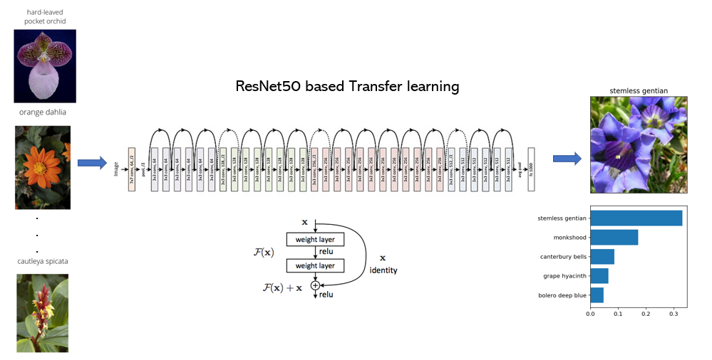

# Deep flower classifier using PyTorch ResNet50

This repository contains the code for building an image classifier that can identify different species of flowers. This was build on pytorch deep learning framework and using python. This project was completed as part of **AI Programming with Python Nanodegree program (Udacity)**.

The project can be broken into the following subparts
* Loading and preprocessing the dataset using `torchvision`
* Train the model
* Predict the flower category using the trained model 

This project uses **Transfer learning** for training the model. First, a pretrained Deep Learning CNN architecture (like resnet, vgg, desnet, etc,.) is first loaded from `torchvision.models`. Then a custom classifier is built on top of pre-trained model using ReLU activations and dropouts. While training use the features from pre-trained network and use backpropagation for classification layers.   

The project supports running execution in both CPU and CUDA environments.

Date Created : 05/05/2020
Author: Janani, S. Babu

## Dataset
The model uses the dataset from [Maria-Elena Nilsback and Andrew Zisserman](http://www.robots.ox.ac.uk/~vgg/data/flowers/102/index.html) which has 102 categories of flowers mapped in training, testsing and validation sets. 

## Required files for execution
* `train.py` - builds and trains the model on a specified dataset and saves a checkpoint file
* `predict.py` - loads the trained network and predicts the classification for an input image
* `image_processing_utils.py` - contains all the image processing utility functions
* `classifier_network.py` - defines the classifier network and contains methods used for network specific operations like training and validating the network

## Usage
Refer to **usage_train.py.png** and **usage_test.py.png** for input arguments. Alternatively you can use -h to display the help section of the application (example: python train.py -h)

**Training**

Basic usage - `python train.py data_directory`.  

Options
* Set directory to save checkpoints: `python train.py data_dir --save_dir save_directory`
* Choose architecture: `python train.py data_dir --arch "resnet50"`
* Set hyperparameters: `python train.py data_dir --learning_rate 0.01 --hidden_units 512 --epochs 20`
* Set multiple hidden layers: `python train.py data_dir --learning_rate 0.01 --hidden_units 1024 512 256 --epochs 20`
* Use GPU for training: `python train.py data_dir --gpu`

**Prediction**

Basic usage - `python predict.py /path/to/image checkpoint`.
 
Options
* Return top K most likely classes: `python predict.py input checkpoint --top_k 3`
* Use a mapping of categories to real names: `python predict.py input checkpoint --category_names cat_to_name.json`
* Use GPU for inference: `python predict.py input checkpoint --gpu`

The mapping of category label to catgory name can be found in `cat_to_name.json` file. This file is needed to display the classified flower names

# Dependencies
* python 3.7
* pytorch 1.5.0
* cudatoolkit 10.2.89
* torchvision 0.6.0 
* json
